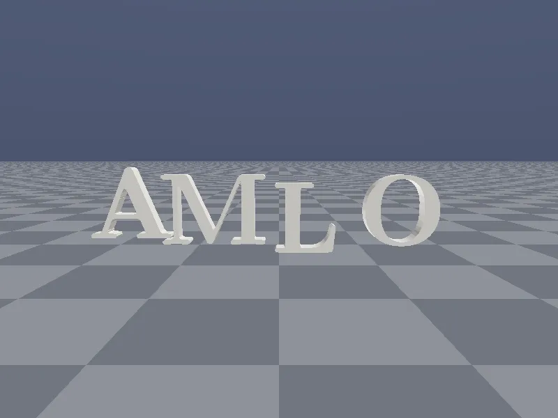
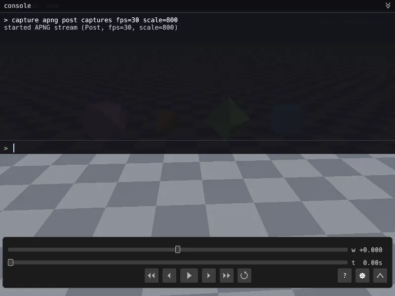
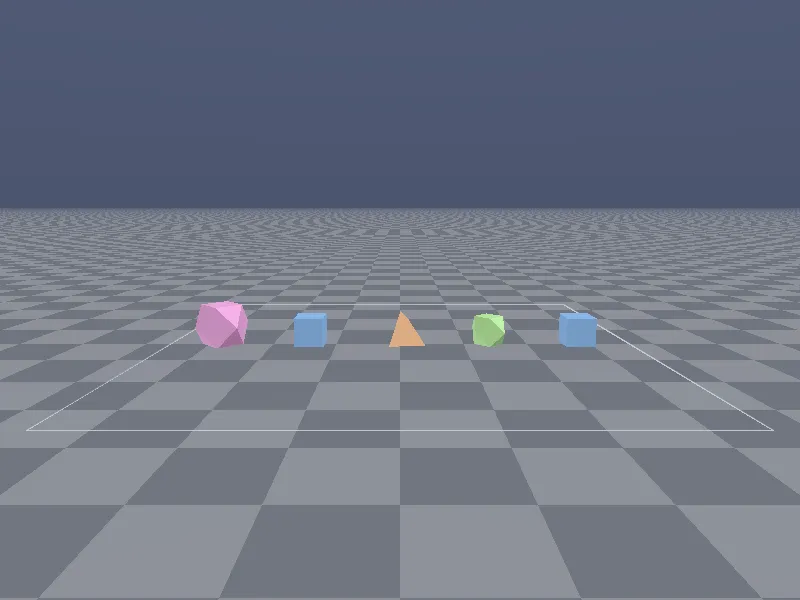

# Loam



A Rust game engine where the geometry of the world is a parameter the game picks. A scene names its space, and rendering, physics, and input run in that space. Flat 4D is the space the demos use today; curved and glued spaces sit behind the same trait.

The animation above is a simulation. The letters are 4D solids, the shapes that knock them over are rigid bodies under 4D gravity, and the ending is the 3D slice sweeping along the fourth axis. The `hero` crate in this repo records it.

[](https://github.com/throgsoft/loam/actions/workflows/ci.yml)

## Run it

```
cargo run --release -p polytope_playground                    # native
cargo run --release -p polytope_playground -- --scene=toybox  # straight into the toybox
trunk serve --release crates/polytope_playground/index.html   # browser, from the repo root
```

Rust 1.95, pinned in `rust-toolchain.toml`. Native runs through wgpu (Vulkan on my Windows machine); the browser build runs on WebGPU and needs [trunk](https://trunkrs.dev/). The backtick key opens a console in either build, and `help` lists its commands.

## Polytope Playground



The six regular 4-polytopes, from the 5-cell to the 600-cell, turning through any of the six rotation planes of 4D space. What you see is the exact 3D cross-section of each solid at the current w, recomputed every frame, with the full 4D edge graph drawn over it if you want it. Slide along w and the sections grow, split, and vanish. Turn in a plane that includes w and the section changes shape as the solid passes through your slice.



The toybox drops the same solids onto a floor under 4D gravity. Click a shape to pick it up by the section you can see, drag it, and let go to throw it; an off-centre grab spins it. Hold Shift and the up-and-down of your drag becomes motion through w, so you can push a shape out of your slice, where it keeps falling and colliding until you scrub the slice after it. When they stack and settle, that is the rigid-body solver working in four dimensions.

## What the engine does

- One `Space` trait, nine geometries: Euclidean R², R³, R⁴; hyperbolic H³; spherical S³ in two charts; a flat 3-torus and a lens space that carry their own gluings; and a variable-curvature blend kept for tests.
- 4D rigid bodies: rotors and bivectors for orientation and spin, GJK and EPA collision in R⁴, persistent contacts, an impulse solver.
- Two ways to draw the same 4D scene: exact cross-sections and edge graphs through a rasterizer, or signed-distance fields through a raymarcher.
- An app shell for native and browser builds: a scene registry, a console, per-section frame timing, and on native a capture path to PNG, GIF, or APNG.

Rustdoc for every crate: [throgsoft.github.io/loam](https://throgsoft.github.io/loam/). Start with the `loam` crate for how the pieces fit.

## Where it is going

Next is scripting, so a scene is a file rather than Rust, then a first-party UI and multi-core simulation. After that, 4D versions of the classic simulations (fluids, boids, cellular automata) on GPU compute, then games, with the engine growing as they need it. I have no dates for any of it.

## Lineage

Marc ten Bosch's *4D Toys* is the direct ancestor of the playground: four-dimensional objects living in a 4D space whose 3D slices you inspect. Zeno Rogue's *HyperRogue*, CodeParade's HyperEngine and *Hyperbolica*, and Michael Walczyk's `polychora` shaped the non-Euclidean and 4D rendering choices. The textbook citations sit in the rustdoc at each use: Coxeter for the polytopes, Hestenes and Sobczyk for the geometric algebra, do Carmo for the Riemannian geometry.

## Getting involved

I build this alone, in the open, and I lean on AI coding tools. Invariant tests cover every primitive, and what ships is my responsibility. Reach out before starting anything: [humesze@proton.me](mailto:humesze@proton.me).

## License

MIT OR Apache-2.0. See [LICENSE-MIT](LICENSE-MIT) and [LICENSE-APACHE](LICENSE-APACHE).
